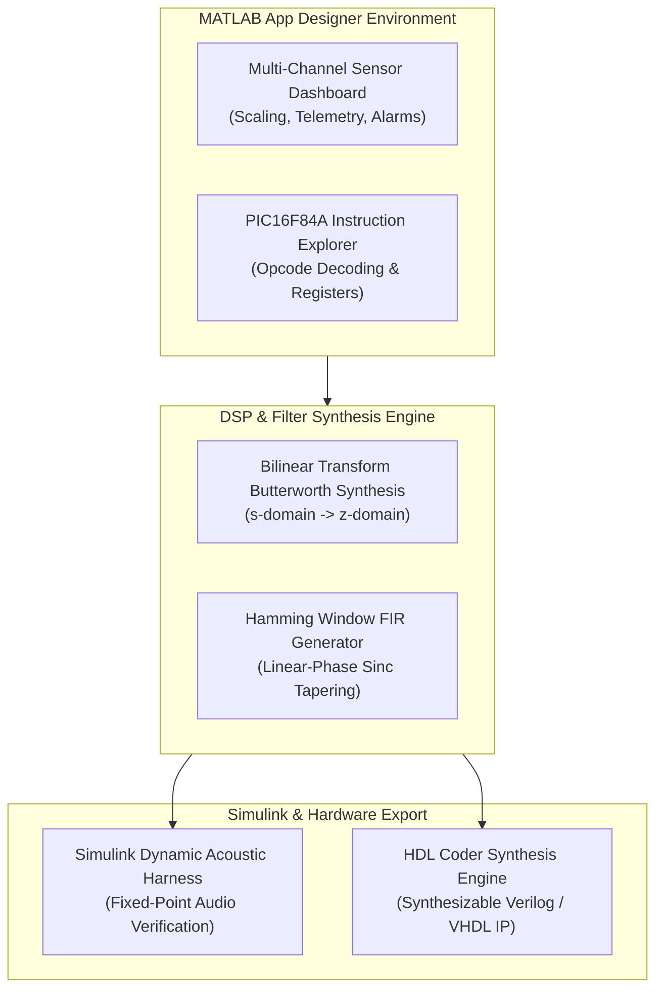

# MATLAB Engineering Suite: Telemetry Apps, DSP Filters & Simulink Models

[](https://github.com/HarryRogers073/matlab-projects)
[](https://www.mathworks.com)
[](LICENSE)

> A consolidated suite of **MATLAB applications, Simulink dynamic models, and Digital Signal Processing (DSP) algorithms** engineered across BEng Electronic & Computer Engineering coursework at the **University of Brighton**. Spans interactive App Designer GUI instruments, microchip instruction emulation, Bilinear Transformation filter synthesis, acoustic simulation harnesses, and FPGA HDL IP code generation.

---

### 📜 Academic Integrity & Attribution Disclosure
- **Author & Mathematical Modeling:** Authored by **Harry Rogers** across Digital Signal Processing and Embedded Systems coursework at the University of Brighton.
- **Toolbox & Environment IP:** Utilizes MathWorks MATLAB, Simulink, DSP System Toolbox, and HDL Coder built-in mathematical primitives (`bilinear`, `tf`, `bode`, `hamming`). MATLAB and Simulink are registered trademarks of **The MathWorks, Inc.**
- **Instruction Set Architecture:** The PIC16F84A Instruction Explorer decodes and simulates the instruction set architecture specified in Microchip Technology document DS35007B.

---

## 🎯 Included Engineering Projects

### 1. Interactive Telemetry & App Designer Dashboards (`app_designer/`)
- **Multi-Channel Hardware Sensor Dashboard (`HarryRogers_22835293_EO631_GUI_APP.mlapp`):**
  - Real-time plotting, scaling, offset calibration, and threshold alarms across analog inputs (`A0` - `A5`).
  - JSON-driven hardware profiles allowing instant loading and saving of sensor calibrations (`config_schemas/`).
- **PIC16F84A Instruction Explorer (`PIC16F84A_Instruction_Explorer.mlapp`):**
  - Step-by-step instruction execution emulator written in MATLAB, visualizing opcode decoding, register file updates (W, STATUS, PORTA, PORTB), flag states, and instruction fetch cycles.

### 2. DSP Filter Design & Audio Processing (`dsp_filter_design/`)
- **IIR Filter Synthesis via Bilinear Transformation (`Butterworth.m`):**
  - Synthesizes Butterworth low-pass, high-pass, and band-pass filters from continuous-time analog prototypes ($s$-domain) mapped into discrete $z$-domain transfer functions with frequency pre-warping.
- **FIR Linear-Phase Windowing (`Hamming.m`):**
  - Designs linear-phase FIR filters using windowed sinc truncation and Kaiser/Hamming tapering.
  - Analyzes trade-offs between filter order $N$, transition bandwidth, and stopband ripple.

### 3. Simulink Dynamic Acoustic Harness (`simulink/`)
- **`Final_Model_2025A.slx`:**
  - Real-time time-domain and spectral comparison between raw audio input, simulated acoustic interference, and filtered outputs.
  - Discrete fixed-point quantization analysis and overflow risk mitigation.

### 4. Synthesizable HDL IP Export (`hdl_export/`)
- **Automated HDL Coder Pipeline (`export_hdl_IP.m`):**
  - Generates synthesizable Verilog/VHDL RTL filter cores from MATLAB transfer functions, with automated behavioral testbench verification (`export_hdl_IP_tb.m`).

---

## 📊 Processing Pipeline



---

## 📂 Repository Contents

```
matlab-projects/
├── app_designer/                              # Interactive MATLAB App Designer GUIs
│   ├── HarryRogers_22835293_EO631_GUI_APP.mlapp # Multi-sensor telemetry & control dashboard
│   ├── PIC16F84A_Instruction_Explorer.mlapp   # Interactive PIC16 opcode execution explorer
│   ├── FinalApp.mlapp                         # Baseline sensor monitor
│   └── config_schemas/                        # JSON calibration profiles (Test.json, Example.json)
├── dsp_filter_design/                         # Classical and modern filter algorithms
│   ├── Butterworth.m                          # Butterworth IIR filter synthesis
│   ├── Hamming.m                              # Hamming window FIR filter generator
│   ├── Combined.m                             # Comparative filter analysis
│   └── *.fcf                                  # Filter coefficient configuration files
├── simulink/                                  # Simulink simulation models
│   └── Final_Model_2025A.slx                  # Dynamic audio streaming & filtering model
├── hdl_export/                                # FPGA HDL Coder scripts
│   ├── export_hdl_IP.m                        # Automated HDL Coder export pipeline
│   ├── export_hdl_IP_tb.m                     # HDL testbench generation script
│   └── hdl_IP.m                               # Filter behavioral function definition
└── audio_samples/                             # Acoustic verification benchmarks
    ├── jazz_song.wav                          # Raw audio input
    ├── Filtered_jazz_song.wav                 # Filtered audio output
    └── march_song.wav                         # Transient benchmark audio
```

---

## 🛠️ Usage Instructions

### Launching App Designer Tools
In the MATLAB Command Window:
```matlab
app = HarryRogers_22835293_EO631_GUI_APP;
```
To run the PIC instruction emulator:
```matlab
app = PIC16F84A_Instruction_Explorer;
```

### Running Filter Synthesis & Simulink
```matlab
cd dsp_filter_design
Butterworth
```
Open `simulink/Final_Model_2025A.slx` and click **Run** to observe real-time spectrum analyzer traces.

---

## 🎓 Academic Attribution

- **Author:** Harry Rogers
- **Degree:** BEng (Hons) Electronic & Computer Engineering (First-Class Honours)
- **Institution:** University of Brighton
- **Curriculum:** Digital Signal Processing & Embedded Telemetry Systems (Distinction Grade)
- **Portfolio:** [www.harry-rogers.com](https://www.harry-rogers.com)
- **LinkedIn:** [linkedin.com/in/harryrogers073](https://www.linkedin.com/in/harryrogers073/)

---

## 📄 License
This repository is licensed under the MIT License - see [LICENSE](LICENSE) for details.
