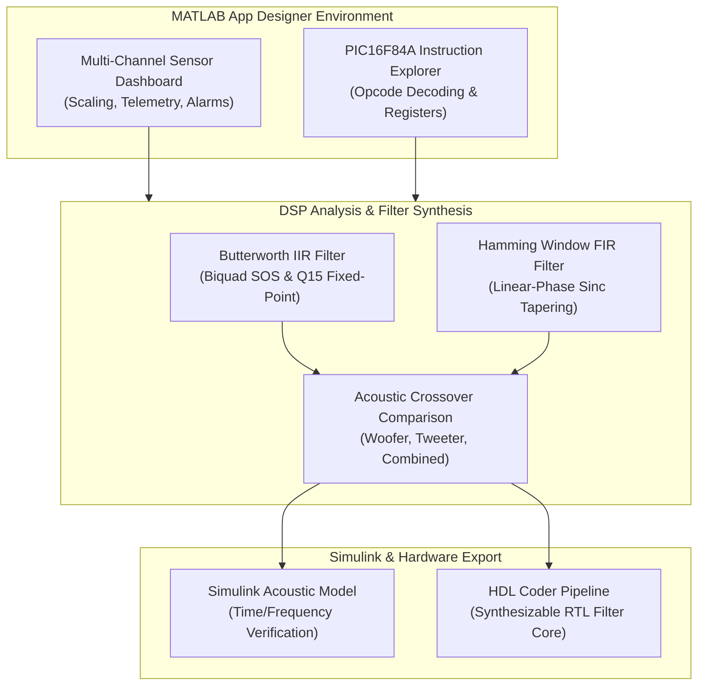

# MATLAB Engineering Suite: Telemetry Apps, DSP Filters & Simulink Models

[](https://github.com/HarryRogers073/matlab-projects)
[](https://www.mathworks.com)
[](LICENSE)

> A collection of **MATLAB applications, Simulink simulation models, and Digital Signal Processing (DSP) filter analysis scripts** developed across BEng Electronic & Computer Engineering coursework at the **University of Brighton**. Includes interactive App Designer desktop instruments, CPU instruction emulation, audio filter response analysis, and HDL Coder export models.

---

### Academic Integrity & Attribution Disclosure

| Subsystem / File | Description | Author / Provenance |
| :--- | :--- | :--- |
| **`HarryRogers_22835293_EO631_GUI_APP.mlapp`** | Multi-channel hardware sensor telemetry GUI with live plotting and alarms | **Harry Rogers** (Original Application) |
| **`PIC16F84A_Instruction_Explorer.mlapp`** | CPU instruction emulator visualizing opcode decode and register state | **Harry Rogers** (Original Application) |
| **`Combined.m` & `New_Combined.m`** | Acoustic crossover frequency response comparison between IIR and FIR filters | **Harry Rogers** (Coursework Analysis) |
| **`partg.m`** | 16-bit Q15 fixed-point integer coefficient verification (200 Hz cutoff) | **Harry Rogers** (Coursework Analysis) |
| **`Part_h.m`** | 4th-order Butterworth low-pass filter design with biquad SOS decomposition | **Harry Rogers** (Coursework Analysis) |
| **`fileFormatting.m` & `filterOrderTests.m`** | Audio sample mono conversion, 44.1 kHz resampling, and listening test harness | **Harry Rogers** (Coursework Analysis) |
| **`test_widths.m`** | Transition bandwidth parameter sweeps analyzing required filter order $N$ | **Harry Rogers** (Coursework Analysis) |
| **`Butterworth.m` & `Hamming.m`** | Discrete-time filter objects generated via `fdesign.lowpass` and `fir1` | **MathWorks DSP System Toolbox** |
| **`Final_Model_2025A.slx`** | Simulink model for audio crossover filtering and noise injection | **Harry Rogers** (Simulink Model) |
| **`export_hdl_IP.m` & `hdl_IP.m`** | Synthesizable RTL export harness using MATLAB HDL Coder | **MathWorks HDL Coder Harness** |

- MATLAB and Simulink are registered trademarks of **The MathWorks, Inc.**

---

## Projects & Included Modules

### 1. Interactive Telemetry & App Designer Dashboards (`app_designer/`)
- **Multi-Channel Hardware Sensor Dashboard (`HarryRogers_22835293_EO631_GUI_APP.mlapp`):**
  - Real-time plotting, scaling, offset calibration, and threshold alarms across analog inputs (`A0` - `A5`).
  - JSON-driven hardware configuration profiles (`config_schemas/`) for saving and restoring sensor calibrations.
- **PIC16F84A Instruction Explorer (`PIC16F84A_Instruction_Explorer.mlapp`):**
  - Step-by-step CPU architecture emulator written in MATLAB, visualizing opcode decoding, register updates (W, STATUS, PORTA, PORTB), and ALU flag states.

### 2. DSP Filter Design & Audio Processing (`dsp_filter_design/`)
- **Acoustic Loudspeaker Crossover (`Combined.m`, `New_Combined.m`):**
  - Compares woofer, tweeter, and combined frequency responses between IIR Butterworth and FIR Hamming windowed filters.
- **Fixed-Point Quantization (`partg.m`, `Part_h.m`):**
  - Verifies exact integer Q15 arithmetic and biquad second-order section (SOS) decomposition for embedded hardware implementations.
- **Audio Sample Pre-Processing (`fileFormatting.m`, `filterOrderTests.m`):**
  - Downmixes audio files to mono, resamples to 44.1 kHz standard, and verifies attenuation across audio test tracks (`audio_samples/`).

### 3. Simulink Audio Simulation (`simulink/`)
- **`Final_Model_2025A.slx`:**
  - Real-time time-domain and spectral comparison between raw audio input, simulated acoustic noise, and filtered output channels.

### 4. Synthesizable HDL Export (`hdl_export/`)
- **`export_hdl_IP.m` & `export_hdl_IP_tb.m`:**
  - Uses MATLAB HDL Coder to generate synthesizable Verilog/VHDL RTL filter cores from transfer function objects with automated testbench verification.

---

## Processing Pipeline



---

## Repository Structure

```text
matlab-projects/
├── app_designer/                   # Interactive MATLAB GUIs (Harry Rogers)
│   ├── HarryRogers_22835293_EO631_GUI_APP.mlapp # Sensor dashboard
│   ├── PIC16F84A_Instruction_Explorer.mlapp    # CPU emulator
│   └── config_schemas/             # JSON sensor configuration files
├── dsp_filter_design/              # DSP Analysis & Filter Scripts
│   ├── Combined.m                  # Crossover frequency response analysis (Harry Rogers)
│   ├── New_Combined.m              # Coursework report visualization (Harry Rogers)
│   ├── partg.m                     # Q15 fixed-point coefficient verification (Harry Rogers)
│   ├── Part_h.m                    # Butterworth biquad decomposition (Harry Rogers)
│   ├── fileFormatting.m            # Audio resampling & mono downmix (Harry Rogers)
│   ├── filterOrderTests.m          # Filter order sweep testing (Harry Rogers)
│   ├── test_widths.m               # Transition width parameter sweeps (Harry Rogers)
│   ├── Butterworth.m               # Filter object (Generated via MATLAB DSP Toolbox)
│   └── Hamming.m                   # Filter object (Generated via MATLAB DSP Toolbox)
├── simulink/                       # Dynamic simulation models
│   └── Final_Model_2025A.slx       # Audio crossover simulation model (Harry Rogers)
├── hdl_export/                     # Synthesizable RTL export scripts
│   ├── export_hdl_IP.m             # HDL Coder export runner
│   └── export_hdl_IP_tb.m          # Automated HDL testbench
└── audio_samples/                  # Evaluation audio tracks (.wav)
```

---

## Getting Started

1. Open **MATLAB** (R2022b or later).
2. To run the Sensor Telemetry Dashboard:
   ```matlab
   cd app_designer
   app = HarryRogers_22835293_EO631_GUI_APP;
   ```
3. To run the PIC16F84A Instruction Explorer:
   ```matlab
   cd app_designer
   app = PIC16F84A_Instruction_Explorer;
   ```
4. To run the audio crossover comparison:
   ```matlab
   cd dsp_filter_design
   New_Combined
   ```

---

## Academic Information & Author

- **Author:** Harry Rogers
- **Degree:** BEng (Hons) Electronic & Computer Engineering (First Class 80%)
- **Institution:** University of Brighton
- **Modules:** Digital Signal Processing (EO626, Upper Second Class 68%) & Embedded Systems (EO631, First Class 84%)
- **Website:** [www.harry-rogers.com](https://www.harry-rogers.com)
- **LinkedIn:** [linkedin.com/in/harryrogers073](https://www.linkedin.com/in/harryrogers073/)

---

## License
This repository is licensed under the MIT License - see [LICENSE](LICENSE) for details.
